# Iceberg

​		官方的定义，[iceberg](https://bigdata.djbook.top/sitetag/iceberg/)是一种表格式。我们可以简单理解为他是**基于计算层（flink、spark）和存储层（orc、parqurt）的一个中间层，我们可以把它定义成一种“数据组织格式”，Iceberg将其称之为“表格式”也是表达类似的含义。他与底层的存储格式（比如ORC、Parquet之类的列式存储格式）最大的区别是，它并不定义数据存储方式，而是定义了数据、元数据的组织方式，向上提供统一的“表”的语义。**它构建在数据存储格式之上，其底层的数据存储仍然使用 Parquet、ORC 等进行存储。在hive建立一个iceberg格式的表。用flink或者spark写入iceberg，然后再通过其他方式来读取这个表，比如 spark、flink、presto 等。

### 优势

- **增量读取处理能力**：Iceberg 支持通过流式方式读取增量数据，支持 Structed Streaming 以及 Flink table Source；
- **支持事务（ACID）**，上游数据写入即可见，不影响当前数据处理任务，简化ETL；提供upsert和merge into能力，可以极大地缩小数据入库延迟；
- **可扩展的元数据**，快照隔离以及对于文件列表的所有修改都是原子操作；
- **同时支持流批处理、支持多种存储格式和灵活的文件组织**：提供了基于流式的增量计算模型和基于批处理的全量表计算模型。批处理和流任务可以使用相同的存储模型，数据不再孤立；Iceberg支持隐藏分区和分区进化，方便业务进行数据分区策略更新。支持Parquet、Avro以及ORC等存储格式。
- **支持多种计算引擎**，优秀的内核抽象使之不绑定特定的计算引擎，目前Iceberg支持的计算引擎有Spark、Flink、Presto以及Hive。

# 官网

## Evolution

https://iceberg.apache.org/docs/latest/evolution/

>Iceberg supports the following schema evolution changes:
>
>- **Add** – add a new column to the table or to a nested struct
>- **Drop** – remove an existing column from the table or a nested struct
>- **Rename** – rename an existing column or field in a nested struct
>- **Update** – widen the type of a column, struct field, map key, map value, or list element
>- **Reorder** – change the order of columns or fields in a nested struct
>
>Iceberg schema updates are **metadata changes**, so no data files need to be rewritten to perform the update.
>
>Note that map keys do not support adding or dropping struct fields that would change equality.
>
>## Partition evolution
>
>## [Sort order evolution](https://iceberg.apache.org/docs/latest/evolution/#sort-order-evolution)

## Maintenance

https://iceberg.apache.org/docs/latest/maintenance/

>Each write to an Iceberg table creates a new *snapshot*, or version, of a table. Snapshots can be used for time-travel queries, or the table can be rolled back to any valid snapshot.
>
>### Remove old metadata files
>
>Iceberg keeps track of table metadata using JSON files. **Each change to a table produces a new metadata file to provide atomicity.**
>
>Old metadata files are kept for history by default. **Tables with frequent commits, like those written by streaming jobs, may need to regularly clean metadata files.**
>
>To automatically clean metadata files, set `write.metadata.delete-after-commit.enabled=true` in table properties. This will keep some metadata files (up to `write.metadata.previous-versions-max`) and will delete the oldest metadata file after each new one is created.
>
>### Delete orphan files[ 🔗](https://iceberg.apache.org/docs/latest/maintenance/#delete-orphan-files)
>
>In Spark and other distributed processing engines, task or job failures can leave files that are not referenced by table metadata, and in some cases normal snapshot expiration may not be able to determine a file is no longer needed and delete it.
>
>### Compact data files[ 🔗](https://iceberg.apache.org/docs/latest/maintenance/#compact-data-files)
>
>Iceberg tracks each data file in a table. More data files leads to more metadata stored in manifest files, and small data files causes an unnecessary amount of metadata and less efficient queries from file open costs.
>
>### Rewrite manifests
>
>Iceberg uses **metadata in its manifest list and manifest files speed up query planning and to prune unnecessary data files.** The metadata tree functions as an index over a table’s data.
>
>When a table’s write pattern doesn’t align with the query pattern, **metadata can be rewritten to re-group data files into manifests using `rewriteManifests` or the `rewriteManifests` action (for parallel rewrites using Spark).**

## Partitioning[ 🔗](https://iceberg.apache.org/docs/latest/partitioning/#partitioning)

>## What is partitioning?[ 🔗](https://iceberg.apache.org/docs/latest/partitioning/#what-is-partitioning)
>
>Partitioning is a way to make queries faster by grouping similar rows together when writing.
>
>For example, queries for log entries from a `logs` table would usually include a time range, like this query for logs between 10 and 12 AM:
>
>```SQL
>SELECT level, message FROM logs
>WHERE event_time BETWEEN '2018-12-01 10:00:00' AND '2018-12-01 12:00:00'
>```
>
>## What does Iceberg do differently?
>
>Other tables formats like Hive support partitioning, but Iceberg supports *hidden partitioning*.
>
>- Iceberg handles the tedious and error-prone task of producing partition values for rows in a table.
>- Iceberg avoids reading unnecessary partitions automatically. Consumers don’t need to know how the table is partitioned and add extra filters to their queries.
>- Iceberg partition layouts can evolve as needed.
>
>### Problems with Hive partitioning
>
>This leads to several problems:
>
>- Hive can’t validate partition values – it is up to the writer to produce the correct value
>- It is up to the user to write queries correctly
>- Working queries are tied to the table’s partitioning scheme, so **partitioning configuration cannot be changed without breaking queries**
>
>### Iceberg’s hidden partitioning
>
>Most importantly, queries no longer depend on a table’s physical layout. **With a separation between physical and logical, Iceberg tables can evolve partition schemes over time as data volume changes. Misconfigured tables can be fixed without an expensive migration.**

## Performance

>- Iceberg is designed for huge tables and is used in production where a *single table* can contain tens of petabytes of data.
>- Even multi-petabyte tables can be read from a single node, without needing a distributed SQL engine to sift through table metadata.
>
>## Scan planning
>
>**Scan planning is the process of finding the files in a table that are needed for a query.**
>
>**Planning in an Iceberg table fits on a single node** because Iceberg’s metadata can be used to prune *metadata* files that aren’t needed, in addition to filtering *data* files that don’t contain matching data.
>
>Fast scan planning from a single node enables:
>
>- **Lower latency SQL queries** – by eliminating a distributed scan to plan a distributed scan
>- **Access from any client** – stand-alone processes can read data directly from Iceberg tables
>
>### Metadata filtering
>
>Iceberg uses two levels of metadata to track the files in a snapshot.
>
>- **Manifest files** store **a list of data files**, along each **data file’s partition data and column-level stats**
>- A **manifest list** stores **the snapshot’s list of manifests**, along with **the range of values for each partition field**
>
>For fast scan planning, Iceberg first filters manifests using the partition value ranges in the manifest list. Then, it reads each manifest to get data files. With this scheme, the manifest list acts as an index over the manifest files, making it possible to plan without reading all manifests.
>
>In addition to partition value ranges, a manifest list also stores the number of files added or deleted in a manifest to speed up operations like snapshot expiration.
>
>### Data filtering
>
>Manifest files include a tuple of partition data and column-level stats for each data file.
>
>During planning, query predicates are automatically converted to predicates on the partition data and applied first to filter data files. Next, column-level value counts, null counts, lower bounds, and upper bounds are used to eliminate files that cannot match the query predicate.
>
>By using upper and lower bounds to filter data files at planning time, Iceberg uses clustered data to eliminate splits without running tasks. In some cases, this is a [10x performance improvement](https://conferences.oreilly.com/strata/strata-ny-2018/cdn.oreillystatic.com/en/assets/1/event/278/Introducing Iceberg_ Tables designed for object stores Presentation.pdf).

## Reliability

>Iceberg tracks the complete list of data files in each [snapshot](https://iceberg.apache.org/terms#snapshot) **using a persistent tree structure**. Every write or delete produces a new snapshot that **reuses as much of the previous snapshot’s metadata tree as possible to avoid high write volumes.**
>
>Valid snapshots in an Iceberg table are stored in the table metadata file, along with a reference to the current snapshot. Commits replace the path of the current table metadata file using an atomic operation. This ensures that all updates to table data and metadata are atomic, and is the basis for [serializable isolation](https://en.wikipedia.org/wiki/Isolation_(database_systems)#Serializable).
>
>**Valid snapshots in an Iceberg table are stored in the table metadata file, along with a reference to the current snapshot.**  **Commits replace the path of the current table metadata file using an atomic operation. This ensures that all updates to table data and metadata are atomic, and is the basis for [serializable isolation](https://en.wikipedia.org/wiki/Isolation_(database_systems)#Serializable).**
>
>This results in improved reliability guarantees:
>
>- **Serializable isolation**: All table changes occur in a linear history of atomic table updates
>- **Reliable reads**: Readers always use a consistent snapshot of the table without holding a lock
>- **Version history and rollback**: Table snapshots are kept as history and tables can roll back if a job produces bad data
>- **Safe file-level operations**. **By supporting atomic changes, Iceberg enables new use cases, like safely compacting small files and safely appending late data to tables.**
>
>## Concurrent write operations
>
>Iceberg supports multiple concurrent writes using **optimistic concurrency**.
>
>Each writer assumes that no other writers are operating and writes out new table metadata for an operation. Then, the writer attempts to commit by atomically swapping the new table metadata file for the existing metadata file.
>
>**If the atomic swap fails because another writer has committed, the failed writer retries by writing a new metadata tree based on the the new current table state.**

## Schemas

>Iceberg tracks each field in a table schema using an ID that is never reused in a table. See [correctness guarantees](https://iceberg.apache.org/docs/latest/evolution#correctness) for more information.

# Flink

>## Writing with DataStream
>
>Iceberg support writing to iceberg table from different DataStream input.
>
>### Appending data.
>
>we have supported writing `DataStream<RowData>` and `DataStream<Row>` to the sink iceberg table natively.
>
>```java
>StreamExecutionEnvironment env = ...;
>
>DataStream<RowData> input = ... ;
>Configuration hadoopConf = new Configuration();
>TableLoader tableLoader = TableLoader.fromHadoopTable("hdfs://nn:8020/warehouse/path", hadoopConf);
>
>FlinkSink.forRowData(input)
>    .tableLoader(tableLoader)
>    .build();
>
>env.execute("Test Iceberg DataStream");
>```
>
>### Overwrite data
>
>To overwrite the data in existing iceberg table dynamically, we could set the `overwrite` flag in FlinkSink builder.
>
>```java
>StreamExecutionEnvironment env = ...;
>
>DataStream<RowData> input = ... ;
>Configuration hadoopConf = new Configuration();
>TableLoader tableLoader = TableLoader.fromHadoopTable("hdfs://nn:8020/warehouse/path", hadoopConf);
>
>FlinkSink.forRowData(input)
>    .tableLoader(tableLoader)
>    .overwrite(true)
>    .build();
>
>env.execute("Test Iceberg DataStream");
>
>```
>
>

# Hive

## Feature support

Iceberg compatibility with Hive 2.x and Hive 3.1.2/3 supports the following features:

- Creating a table
- Dropping a table
- Reading a table
- Inserting into a table (INSERT INTO)

## Enabling Iceberg support in Hive

### Hive 4.0.0-alpha-1

Hive 4.0.0-alpha-1 comes with the Iceberg 0.13.1 included. No additional downloads or jars are needed.

### Hive 2.3.x, Hive 3.1.x

**In order to use Hive 2.3.x or Hive 3.1.x, you must load the Iceberg-Hive runtime jar and enable Iceberg support, either globally or for an individual table using a table property.**

#### Loading runtime jar

**To enable Iceberg support in Hive, the `HiveIcebergStorageHandler` and supporting classes need to be made available on Hive’s classpath. These are provided by the `iceberg-hive-runtime` jar file. For example, if using the Hive shell, this can be achieved by issuing a statement like so:**

```
add jar /path/to/iceberg-hive-runtime.jar;
```

There are many others ways to achieve this including adding the jar file to Hive’s auxiliary classpath so it is available by default. Please refer to Hive’s documentation for more information.

#### Enabling support

**If the Iceberg storage handler is not in Hive’s classpath, then Hive cannot load or update the metadata for an Iceberg table when the storage handler is set.**  To avoid the appearance of broken tables in Hive, Iceberg will not add the storage handler to a table unless Hive support is enabled. The storage handler is kept in sync (added or removed) every time Hive engine support for the table is updated, i.e. turned on or off in the table properties. There are two ways to enable Hive support: **globally in Hadoop Configuration and per-table using a table property.**

##### Hadoop configuration

To enable Hive support globally for an application, set `iceberg.engine.hive.enabled=true` in its Hadoop configuration. **For example, setting this in the `hive-site.xml` loaded by Spark will enable the storage handler for all tables created by Spark.**

Starting with Apache Iceberg `0.11.0`, when using Hive with Tez you also have to disable vectorization (`hive.vectorized.execution.enabled=false`).

##### Table property configuration

Alternatively, the property `engine.hive.enabled` can be set to `true` and added to the table properties when creating the Iceberg table. Here is an example of doing it programmatically:

```java
Catalog catalog=...;
    Map<String, String> tableProperties=Maps.newHashMap();
    tableProperties.put(TableProperties.ENGINE_HIVE_ENABLED,"true"); // engine.hive.enabled=true
    catalog.createTable(tableId,schema,spec,tableProperties)
```

The table level configuration overrides the global Hadoop configuration.

## Catalog Management

**In contrast, Iceberg supports multiple different data catalog types such as Hive, Hadoop, AWS Glue, or custom catalog implementations.**  **Iceberg also allows loading a table directly based on its path in the file system. Those tables do not belong to any catalog. Users might want to read these cross-catalog and path-based tables through the Hive engine for use cases like join.**

To support this, a table in the Hive metastore can represent three different ways of loading an Iceberg table, depending on the table’s `iceberg.catalog` property:

1. The table will be loaded using a `HiveCatalog` that corresponds to the metastore configured in the Hive environment if no `iceberg.catalog` is set
2. The table will be loaded using a custom catalog if `iceberg.catalog` is set to a catalog name (see below)
3. The table can be loaded directly using the table’s root location if `iceberg.catalog` is set to `location_based_table`

### CREATE TABLE AS SELECT

`CREATE TABLE AS SELECT` operation resembles the native Hive operation with a single important difference. The Iceberg table and the corresponding Hive table are created at the beginning of the query execution. The data is inserted / committed when the query finishes. **So for a transient period the table already exists but contains no data.**

```sql
CREATE TABLE target PARTITIONED BY SPEC (year(year_field), identity_field) STORED BY ICEBERG AS
    SELECT * FROM source;
```

#### Hive catalog tables  [link](https://iceberg.apache.org/docs/latest/hive/#hive-catalog-tables)

As described before, **tables created by the `HiveCatalog` with Hive engine feature enabled are directly visible by the Hive engine, so there is no need to create an overlay.**

#### CREATE TABLE overlaying an existing Iceberg table

You can also create a new table that is managed by a custom catalog. For example, the following code creates a table in a custom Hadoop catalog: 

```sql
SET
iceberg.catalog.hadoop_cat.type=hadoop;
SET
iceberg.catalog.hadoop_cat.warehouse=hdfs://example.com:8020/hadoop_cat;

CREATE TABLE database_a.table_a
(
    id   bigint,
    name string
) PARTITIONED BY (
  dept string
) STORED BY 'org.apache.iceberg.mr.hive.HiveIcebergStorageHandler'
TBLPROPERTIES ('iceberg.catalog'='hadoop_cat');
```

**If the table to create already exists in the custom catalog, this will create a managed overlay table.** This means technically you can omit the `EXTERNAL` keyword when creating an overlay table. However, this is **not recommended** because creating managed overlay tables could pose a risk to the shared data files in case of accidental drop table commands from the Hive side, which would unintentionally remove all the data in the table.


-----------------

# 文章

## Flink 1.11新特性之SQL Hive Streaming简单示例

https://www.jianshu.com/p/fb7d29abfa14

https://blog.csdn.net/yuanyuan_gugu/article/details/107404955


## Row-Level Changes on the Lakehouse:  Copy-On-Write vs. Merge-On-Read in Apache Iceberg

https://www.dremio.com/subsurface/row-level-changes-on-the-lakehouse-copy-on-write-vs-merge-on-read-in-apache-iceberg/

While Apache Iceberg delivers ACID guarantees with updates/deletes to the data lakehouse, version 2 (v2) of the Apache Iceberg table format offers the ability to update and delete rows to enable more use cases.  **V2 of the format enables updating and deleting individual rows in immutable data files without rewriting the files.**

There are two approaches to handle deletes and updates in the data lakehouse: **copy-on-write (COW) and merge-on-read (MOR).** 

Like with almost everything in computing, there isn’t a one-size-fits-all approach – each strategy has trade-offs that make it the better choice in certain situations. The considerations largely come down to latency on the read versus write side. These considerations aren't unique to Iceberg or data lakes in general, the same considerations and trade-offs exist in many other places, such as lambda architecture.

### Copy-On-Write (COW) – Best for tables with frequent reads, infrequent writes/updates, or large batch updates

With COW, **when a change is made to delete or update a particular row or rows, the datafiles with those rows are duplicated, but the new version has the updated rows.** This makes writes slower depending on how many data files must be re-written which can lead to concurrent writes having conflicts and potentially exceeding the number of reattempts and failing.

If updating a large number of rows, COW is ideal. However, if updating just a few rows you still have to rewrite the entire data file, making small or frequent changes expensive.

On the read side, COW is ideal as there is no additional data processing needed for reads – the read query has nice big files to read with high throughput.

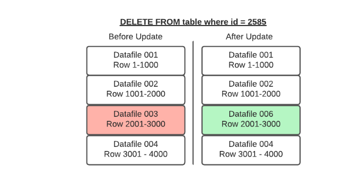

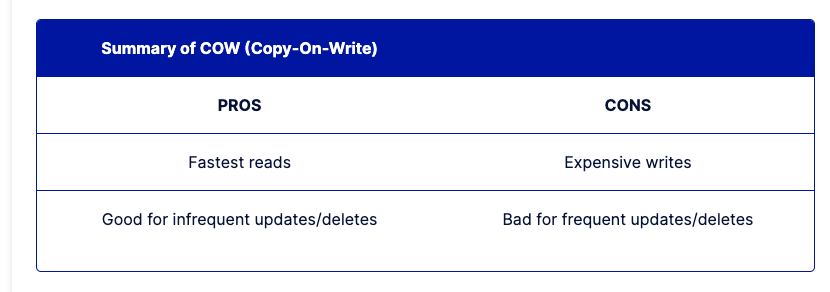

### Merge-On-Read (MOR) – Best for tables with frequent writes/updates

With merge-on-read, the file is not rewritten, instead the changes are written to a new file. **Then when the data is read, the changes are applied or merged to the original data file to form the new state of the data during processing.** 

**This makes writing the changes much quicker**, but also means more work must be done when the data is read.

In Apache Iceberg tables, this pattern is implemented through the use of delete files that track updates to existing data files. 

If you delete a row, **it gets added to a delete file and reconciled on each subsequent read till the files undergo compaction which will rewrite all the data into new files that won’t require the need for the delete file.**（删除行添加到一个新的删除文件，推迟读，直到删除文件和原来的文件写到一个新的文件）

If you update a row,  **that row is tracked via a delete file so future reads ignore it from the old data file and the updated row is added to a new data file.** Again, once compaction is run, all the data will be in fewer data files and the delete files will no longer be needed.

**So when a query is underway the changes listed in the delete files will be applied to the appropriate data files before executing the query.**  （查询之前，删除文件会合并到合适的位置）

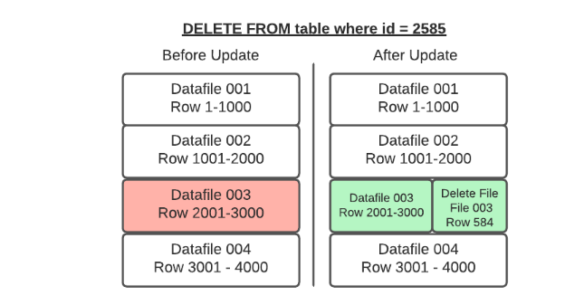

### Position Deletes  （位置删除）

**Position deletes still read files to determine which records are deleted, but instead of rewriting the data files after the read, it only writes a delete file that tracks the file and position in that file of records to be deleted. This strategy greatly reduces write times for updates and deletes, and there is a minor cost to merge the delete files at read time.**

（位置删除不会将数据文件重写，只是会将所有要删除的数据写入一个删除文件。该策略极大的缩减了更新和删除数据的写的时间）

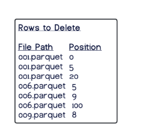

### Equality Deletes  （相等性删除）

When using equality deletes, you save even more time during the write by avoiding reading any files at all. **Instead, the delete file is written to include the fields and values that are targeted by the query.** This makes update/delete writes much faster than using position deletes. However, there is a much higher cost on the read time since it will have to match the delete criteria against all scanned rows to reconcile at read, which can be quite costly.

（相等性删除写入删除文件时节约非常多的时间，因为避免了数据查询。直接将要删除的字段和值写入了删除文件。这导致了写入删除文件时非常快，但是查询时效率非常低下。因为在读的时间会扫描所有的行，去匹配删除条件。）

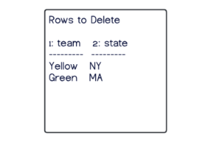

### Minimizing the Read Costs

When running compaction, new data files will be written to reconcile any existing delete files, eliminating the need to reconcile them during read queries. So when using merge-on-read, it is recommended to have **regular compaction jobs to impact reads as little as possible** while still maintaining the faster write speeds.  （定时执行压缩任务，减少对读的影响）

#### Types of Delete Files Summary

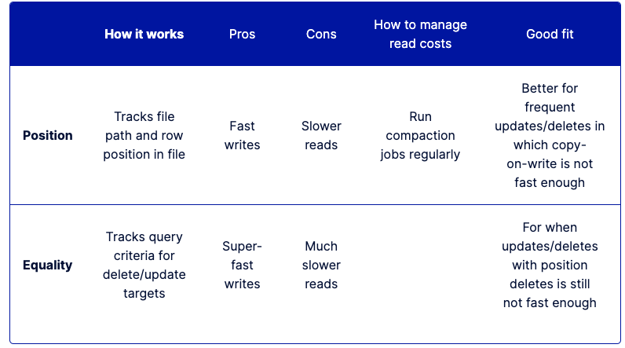

### When to Use COW and When to Use MOR

Architecting your tables to take advantage of COW, MOR/Position deletes or MOR/Equality deletes is based on how the table will be used.

Note that you can choose a strategy you believe is the best option for your table, and if it turns out to be the wrong choice or the workloads change, it’s easy to change the table to use another.

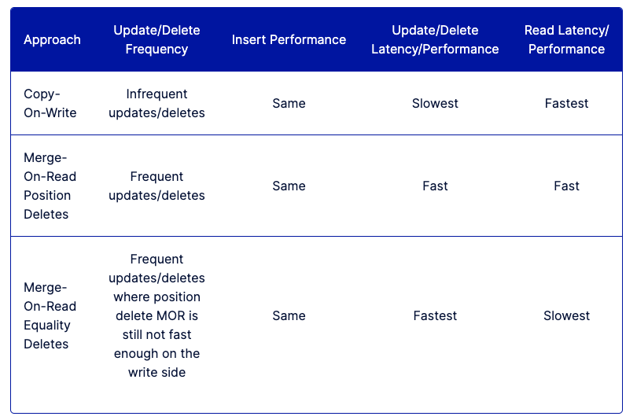

### Configuring COW and MOR

COW and MOR are not an either/or proposition with Apache Iceberg. You can specify different modes in your table settings based on the type of operation, so you can specify deletes, updates, and merges as either COW or MOR independently. For example, you can set the settings when the table is created.

```sql
CREATE TABLE catalog.db.students (
    id int,
    first_name string,
    last_name string,
    major string,
    class_year int
) TBLPROPERTIES (
    'write.delete.mode'='copy-on-write',
    'write.update.mode'='merge-on-read',
    'write.merge.mode'='merge-on-read'
) PARTITIONED BY (class_year) USING iceberg;
```

This can also be changed using `ALTER TABLE` statements:

```sql
ALTER TABLE catalog.db.students SET TBLPROPERTIES (
    'write.delete.mode'='merge-on-read',
    'write.update.mode'='copy-on-write',
    'write.merge.mode'='copy-on-write'
);
```

### Further Optional Delete/Updates Fine-Tuning Strategies

- **Partitioning the table by fields that are often included in query filters, so if you regularly filter a field by a particular timestamp field during updates, then partitioning the table by that field will speed updates.**  (根据查询条件字段进行分区)
- Sorting the table by fields often included in the filters
  (Example: if table partitioned by `day(timestamp)` setting the sort key to `timestamp`).  **（设置排序字段）**
- **Tuning the metadata tracked for each individual column so extra metadata isn’t written for columns** the table is rarely filtered by, ultimately wasting time on the write side. This can be done with the `write.metadata.metrics` category or properties to set a default rule and also customize each column. **（开启每个列的元数据追踪）**

```sql
ALTER TABLE catalog.db.students SET TBLPROPERTIES (
    'write.metadata.metrics.column.col1'='none',
    'write.metadata.metrics.column.col2'='full',
    'write.metadata.metrics.column.col3'='counts',
    'write.metadata.metrics.column.col4'='truncate(16)',
);
```


## 黄彬耕：Iceberg在腾讯微视实时场景的应用.  跟目前我们的场景类似

https://lrting.top/backend/7908/

### kafka 不适用离线

首先看 Kafka，它的成本相对比较高。跟Hive相比，Kafka每单位的存储成本超过了Hive的10倍。其次，它的数据压缩的效果也比较差，同样的数据写入Kafka，压缩后的数据量相比于Hive，也接近10倍。**所以这两个叠加之后，它的成本会比Hive高两个数量级。**

在数据回溯的场景，**第一，Kafka的存储成本比较高，不适合留存比较久的历史数据；第二，它只能基于一个偏移量去做数据回溯，无法确定这个偏移量对应的数据是什么数据。所以相比之下，Hive基于分区的回溯更能符合我们的回溯需求。**

### hive 不适用在线

**首先，它的延迟比较高**。

目前Hive提供的延迟比较低的需求是通过使用 Hive 小时表来提供一个大概延迟在两到三个小时的数据。如果这个延时想要再缩减，可能就需要把Hive的分区做到更细的粒度。更细粒度的分区也可能会带来一些问题，比如小文件的问题，会对HDFS的NameNode造成比较大压力，同时它的读取效率也不高。

**另外，HMS的扩展性问题，Hive的元数据主要是使用MySQL来做存放，MySQL的扩展性不好**。

而如果我们的分区粒度越细，分区数据越多，那MySQL就更容易遇到扩展性问题。同时，太多的分区也会对查询的效率造成一定影响。**因为Hive会首先到元数据去获取这个分区信息的目录，然后再到那个HDFS里面对这些目录做一个list文件的操作，拿到文件之后再去做数据的读取。**这个过程涉及到的分区越多，查询就会越慢。

所以基于这些问题，我们希望有一个存储系统，能够很好地同时支持实时和离线的场景。在成本比较低的情况下，满足我们的实时需求。

现在的数据湖文件系统，都可以对实时和离线提供比较好的支持。我们公司内部主要在使用Iceberg，我们把Iceberg与Hive和Kafka做一个对比。

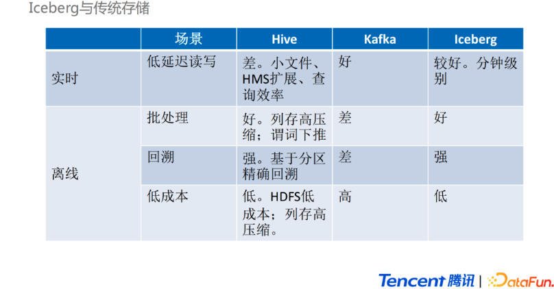

从设计上来看，**Hive对离线场景的支持Iceberg都可以做到，而且在某些方面做得更好。**比如在批处理中，Iceberg的谓词下推可以做到文件级别的过滤，而Hive主要是在分区级别做过滤，然后在文件内部，利用文件的格式再去进行谓词下推。还有Iceberg通过版本控制，可以做到更好的读写分离。**在Hive场景下对一些历史分区做数据压缩，可能会影响线上的读取任务，而Iceberg 不存在这种情况。并且，更为重要的一点是Iceberg提供了更低延时的读写特性。**所以从离线存储的角度来讲，用Iceberg替换Hive可以得到很好的收益。

**从实时的角度来看，Iceberg与Kafka对比，一个显著优势是Iceberg的成本可以低很多**。因为Iceberg跟 Hive 使用的底层存储比较类似，是基于HDFS的，**成本可以做到比Kafka低两个数量级**；相比于 Kafka，Iceberg 在实时性上会差一点。因为Kafka可以做到流式的读写，而Iceberg只能做到分钟级别的延迟。但在我们的数据场景中，强实时的场景比较少，因此Iceberg可以很好地支持我们的实时场景，可以在一些新的增量模型中承载流批一体的存储。

**我们如何使用Iceberg？**

我们目前的架构，**主要是用 Iceberg 来替换掉之前 Kafka 以及 OLAP 组件来承接一部分实时数据需求，以此降低实时数据需求的实现成本。**

**下面介绍一个已经实现的实时需求方案**。这个需求是给我们的运营系统提供一些实时的累积数据。**我们通过 Hive 先提供一个 T+1 天级别的累积数据，然后再把当天的增量数据通过[iceberg](https://lrting.top/tag/iceberg/)来落地。然后在下游配置一个定时调度的推送模块，去做数据的合并，得到最终的实时累计数据，推送到Kafka里面。交付给下游系统。**（当天的增量数据和T+1数据如何合并？）

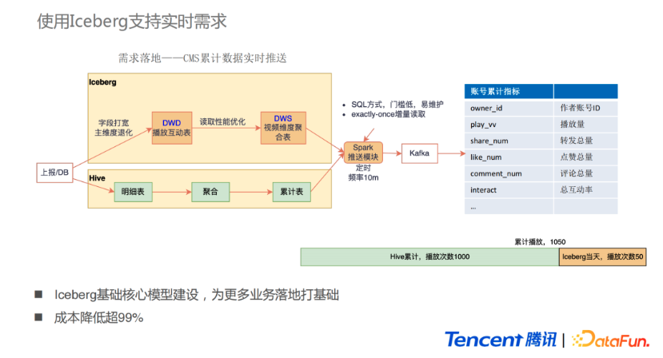

我们用到了 **Iceberg的增量读取接口，不需要推送大量的全量数据，只需要推送实时的增量数据即可，同时也不会出现少推数据的情况。 **这也涉及到了实时维表的需求，因为实时累计数据需要通过一个最终累计的状态表来做。我们一开始尝试了用 Iceberg的upsert功能。但是由于 Iceberg 只支持 copy-on-write 的格式( 现在 iceberg v2 也支持了mor )，而我们的维表每次更新的数据占全量数据的占比很低，可能只有万分之一。如果用 copy-on-write 模式，每次更新数据就要做一个某个 datafile 全量的写入，这样对资源的消耗比较大。所以我们最后还是使用了lambda架构的模式，**通过Hive的累计数据和Iceberg的增量数据，在推送时再去做merge**。**后续也希望可以尝试用Iceberg提供的 merge-on-read 模式去生成实时累计数据来简化流程。**  （ 1. 增量推送数据  2. 全量数据和增量数据的合并 ）

**对于这个模式的需求落地，除了从实验角度考虑之外，也需要考虑到表的复用性**。所以Iceberg 的模型会参照之前的离线数仓去进行建模的规范，同时还要考虑到数据的复用性。在做早期需求的同时，也为后期更多需求落地打好一个基础。用这种Iceberg的方式实现，相比于之前实时链路的 Kafka 加 OLAP 的方案，成本降低超过99%。

**我们并不只是希望 Iceberg 去提供实时的数据，还希望在新的场景中，Iceberg 可以承载流批一体的存储。为了实现这个目标，还需要研究Iceberg是否具有在离线的场景下的一些功能，其中一个是数据回溯功能，像表增加字段或者修改计算口径等操作，都需要去数据回溯。另外，如果上游有数据修复，也会需要去回溯重跑一段历史分区。**

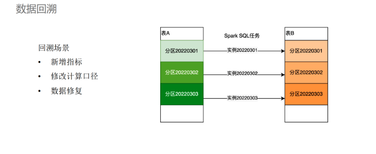

在离线场景下，**数据回溯实现比较简单。**

以填表为例，每个任务的实例必须处理一个某一天分区的数据。如果我们想要回溯3月的1-3 号 3 天的数据，只要在调度平台上把这三个实例任务重跑就可以实现了。但是在流批一体存储的场景下，表可能是使用Flink生成的，Flink的回溯可能会稍有不同，因为它是一个线上一直在运行的任务，无法通过直接重跑的方式去做回溯。可能需要通过复制Flink应用的方式来复用它的数据生产代码，再通过修改参数的方式让Flink的source进入一个回溯的批读模式，最后再通过传参的方式指定回溯的数据时间范围。当然，现在社区在新版本Flink中，source也新增了可以实现这个功能的接口。但是它还存在一些缺陷，比如Flink的source是没有状态的，也就是在回溯任务失败，重启执行后可能会产生一些重复数据。这是因为在第一次跑的时候已经有一些 check 成功了，提交了部分数据，而这时发生了故障失败重启，重启之后的任务又会重新读取source 数据，那么，第一次运行时提交的数据就变成了重复数据。在数仓里，数据回溯之后产生重复数据是不能接受的。**所以还是希望它可以实现exactly once的语义**，也就是数据一致性。

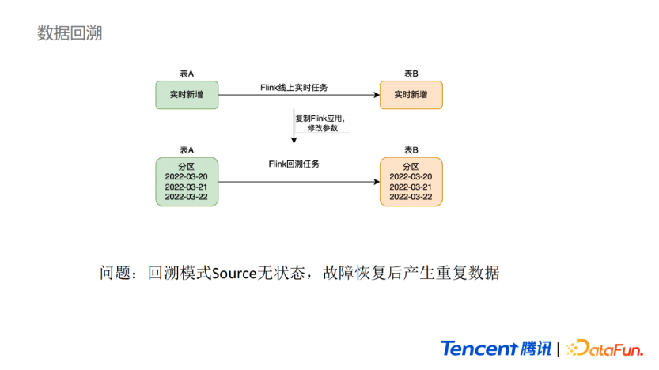

我们通过给 source 增加状态的方式来实现这个功能。在之前一个比较老版本的 Flink 上，我们给它的 source 增加了一个切块的功能。


还需要支持的另一种场景是流转批场景，如果使用Iceberg做流批一体的存储，在上游的明细表，**主要是ODS和DWD层的表可能会使用Flink生成**。但这个表的二次加工可能会使用批处理去做计算。假设批处理是一个3月2号的实例，我们需要在3月3号时触发计算。那这个触发的批处理任务就需要知道上游的数据表什么时候的数据是完备的。如果简单地用一个延时调起方法的话，**在一些异常的场景下会出现问题，比如上游的 Flink 链路出现了问题，导致数据没有产生或者迟到了，那批处理的任务处理的就是一个不完整的数据或者是空跑。如果是人为发现了之后再去做回溯，成本会较高。**

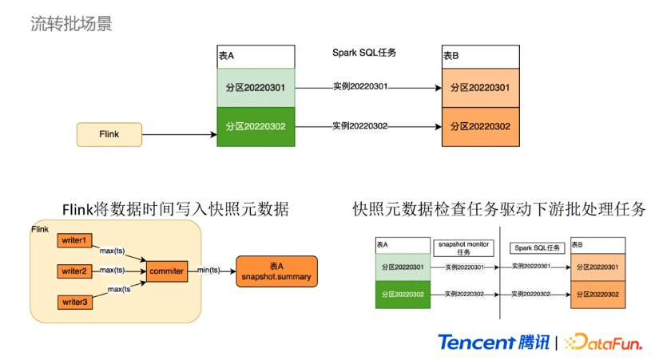

**对此，我们使用的方案是通过在Flink的Sink里面，从数据中选取一个时间字段写入表的快照的方式去通知下游当前的数据进度**，可以看到这里的 Flink Sink 也包含了两个算子。**第一个是一个 writer 算子，它负责把数据写入文件，writer 在checkpoint触发时，会把自己写入的最大的一个时间传到commiter中，然后commiter从多个上游传过来的时间中选取一个最小值作为这一批提交数据的时间，并写入表的元数据。**

在下游的批处理任务之前加一个**监控任务去监控最新快照元数据**。如果它的时间已经超过了当前的分区时间，就认为这个表的数据已经完备了，这个**monitor任务就会成功触发下游的批处理任务进行计算，这样可以防止在异常场景下数据管道或者批处理任务空跑的情况。**  （监控分区数据，主动触发的方式）

**我们在完善 Iceberg 在批处理场景下的功能之后，可以设计一个流批一体的架构**，虽然看起来总体上还是一个lambda架构，但它有一些改进。首先，**它在生成DWD的过程中，统一使用了Flink计算引擎去生成，并进行双写，一份写入Iceberg，另外一份写入Kafka。如果没有强实时的需求，很多数据都不需要再走 Kafka 这条链路。**所以在 DWD 层可以做到计算引擎的统一。**其次MQ的数据除了被Flink任务消费，还会同步一部分落地到ODS层，用作回溯数据的支持。**


在我们用Iceberg替换掉Hive之后可以做一个准实时以及离线场景下的一个流批统一存储，很大程度上解决我们之前遇到的很多指标重复计算带来的口径不一致问题，还有一些冗余的存储开销，节约我们的准实时需求的成本。

我们会在新的一些场景下去落地这个流批一体的方案。

**在Iceberg的表维护场景下的实践**

Iceberg 表在维护过程中比 Hive 稍微复杂一些，Hive 只需要清除过期数据即可，但是Iceberg除了清除过期数据，还要做过期快照的删除、小文件的合并、元数据的合并，还包括清除一些孤儿文件。

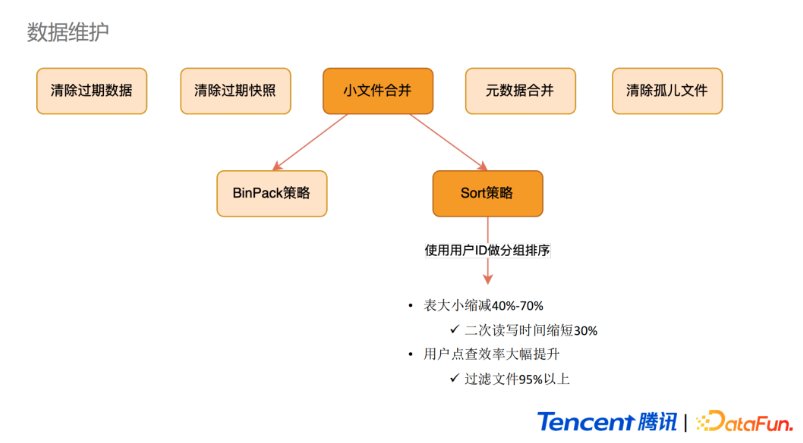、

这些功能大部分平台侧都可以完成。这里讲一下小文件合并的实践。因为Iceberg会用Flink去生成表的数据，Flink的提交的批次间隔比较小，就带来了更多的小文件，因此需要定期去做合并。合并主要是通过Spark实现的。Spark对小文件合并主要有两种策略，一种是BinPack背包策略，另外一种是加入了排序逻辑的Sort策略。背包策略主要是把小文件加入到相同大小到背包里面去做合并，最后每一个背包就是一个合并后的文件。Sort策略在合并小文件的基础上，会做一个分组排序的功能，使用我们指定的一个字段去做分组排序，使得这个字段在各个分区之间整体是有序的，同时每个分区内部也是有序的。分组排序获得的收益主要是可以减少表的大小。

**我们一般在明细表上做分组排序，用Sort策略做小文件合并**。相比于背包策略，合成后表的大小可以缩减 40%到70%。表大小的缩减带来的直接收益是二次读写的时间缩短和点查效率大幅提升，这主要得益于使用这个排序字段做点查时，Flink提供了一个谓词下推的文件过滤效果。

简单分析一下原理。

**首先是存储收益**，因为**Iceberg主要是基于Parquet列存，这种存储格式会通过对数据进行编码以及压缩算法来压缩数据。如果某一列数据的局部相似度很高，那压缩算法就可以更好地发挥它的作用，生成一个更小的数据文件。微视的明细表有一个特征就是大量的字段都跟用户相关。所以我们按照用户ID做数据排序之后，大量的字段相邻的值都是相同或者相似的。最终落地出来的文件大小会比没排序之前小很多。**  （利用了 parquet 列式存储的特性，分组排序后占用的空间更小）

**第二是文件过滤**，这个主要得益于 **Iceberg 在元数据的My Manifest文件里面保存了每一个列值的上下界。**在查询时，可以将查询的条件和每一列的上下界做对比。如果发现这个值不可能存在这个Data范围中，那么在文件扫码阶段就可以把这个文件过滤掉。

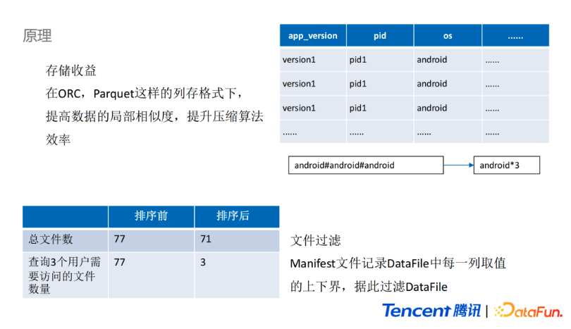

上图是我们做的数据对比，左边一列是使用BinPack策略合并小文件的结果，右边是用Sort策略合并小文件的结果。对于同一份数据进行合并，合并之后的总文件数量大概是70多个，此时查询3个用户的数据，在使用BinPack策略合并后，需要扫描77个文件，也就是没有做任何的文件过滤。但是在Sort排续策略之后，由于已经将其他部分的文件进行了过滤，用户只需要扫描3个文件就可以。如果是查询1个用户的话，就只需要访问一个文件，这个效果是比较明显的。


## 大数据架构变革进行时：为什么腾讯看好 Apache Iceberg？

https://www.infoq.cn/article/59lbbuvcrzlusmdowjbb

> Apache Iceberg、Hudi 和 Delta Lake **这三个定位类似的开源项目正是从数据库方法论中汲取了灵感，将事务能力带到了大数据领域，并抽象成统一的中间格式供不同引擎适配对接。**
>
> 如何定义这类新技术？
>
> 简单地说，这类新技术是介于上层计算引擎和底层存储格式之间的一个中间层，我们可以把它定义成一种“数据组织格式”，Iceberg 将其称之为“表格式”也是表达类似的含义。它与底层的存储格式（比如 ORC、Parquet 之类的列式存储格式）最大的区别是，它并不定义数据存储方式，而是定义了数据、元数据的组织方式，向上提供统一的“表”的语义。它构建在数据存储格式之上，其底层的数据存储仍然使用 Parquet、ORC 等进行存储。
>
> 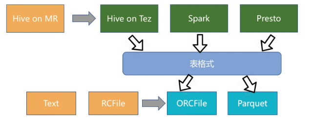
>
> Apache Iceberg、Hudi 和 Delta Lake 诞生于不同公司，需要解决的问题存在差异，因此三者在设计初衷上稍有不同。
>
> Iceberg 的设计初衷更倾向于**定义一个标准、开放且通用的数据组织格式，同时屏蔽底层数据存储格式上的差异，向上提供统一的操作 API，使得不同的引擎可以通过其提供的 API 接入**；**Hudi 的设计初衷更像是为了解决流式数据的快速落地，并能够通过 upsert 语义进行延迟数据修正；**Delta Lake 作为 Databricks 开源的项目，更侧重于在 Spark 层面上解决 Parquet、ORC 等存储格式的固有问题，并带来更多的能力提升。
>
> ### 为什么选择 Iceberg？
>
> 谈及引入 Iceberg 的原因，邵赛赛表示，当时团队在构建大数据生态的过程中遇到了几个痛点，而 Iceberg 恰好能解决这几个痛点：
>
> 1. **T+0 的数据落地和处理。**传统的数据处理流程从数据入库到数据处理通常需要一个较长的环节、涉及许多复杂的逻辑来保证数据的一致性，由于架构的复杂性使得整个流水线具有明显的延迟。**Iceberg 的 ACID 能力可以简化整个流水线的设计，降低整个流水线的延迟。**
> 2. **降低数据修正的成本。**传统 Hive/Spark 在修正数据时需要将数据读取出来，修改后再写入，有极大的修正成本。Iceberg 所具有的修改、删除能力能够有效地降低开销，提升效率。
>
> 至于为何最终选择采用 Iceberg，而不是其他两个开源项目，技术方面的考量主要有以下几点：
>
> - **Iceberg 的架构和实现并未绑定于某一特定引擎，它实现了通用的数据组织格式，利用此格式可以方便地与不同引擎（如 Flink、Hive、Spark）对接，这对于腾讯内部落地是非常重要的，因为上下游数据管道的衔接往往涉及到不同的计算引擎；**
> - **良好的架构和开放的格式。**相比于 Hudi、Delta Lake，Iceberg 的架构实现更为优雅，同时对于数据格式、类型系统有完备的定义和可进化的设计；
> - **面向对象存储的优化。**Iceberg 在数据组织方式上充分考虑了对象存储的特性，避免耗时的 listing 和 rename 操作，使其在基于对象存储的数据湖架构适配上更有优势。
>
> 除去技术上的考量，邵赛赛和团队也对代码质量、社区等方面做了详细的评估：
>
> - 整体的代码质量以及未来的进化能力。整体架构代码上的抽象和优势，以及这些优势对于未来进行演化的能力是团队非常关注的。一门技术需要能够在架构上持续演化，而不会具体实现上需要大量的不兼容重构才能支持。
> - 社区的潜力以及腾讯能够在社区发挥的价值。社区的活跃度是另一个考量，更重要的是在这个社区中腾讯能做些什么，能发挥什么样的价值。如果社区相对封闭或已经足够成熟，那么腾讯再加入后能发挥的价值就没有那么大了，在选择技术时这也是团队的一个重要考量点。
> - 技术的中立性和开放性。社区能够以开放的态度去推动技术的演化，而不是有所保留地向社区贡献，同时社区各方相对中立而没有一个相对的强势方来完全控制社区的演进。
>
> ### 4.痛点总结
>
> 各种计算架构的痛点分析。
>
> ### 5.实时数仓建设需求
>
> 是否存在一种存储技术，既能够支持数据高效的回溯能力，支持数据的更新，又能够实现数据的批流读写，并且还能够实现分钟级到秒级的数据接入？
>
> 这也是实时数仓建设的迫切需求（图 6）。实际上是可以通过对 Kappa 架构进行升级，以解决 Kappa 架构中遇到的一些问题，接下来主要分享当前比较火的数据湖技术--Iceberg。

## Flink + Iceberg 全场景实时数仓的建设实践   

https://developer.aliyun.com/article/781534

对 iceberg 的介绍比较详细。

>是否存在一种存储技术，既**能够支持数据高效的回溯能力，支持数据的更新，又能够实现数据的批流读写，并且还能够实现分钟级到秒级的数据接入**？
>
>这也是实时数仓建设的迫切需求（图 6）。实际上是可以通过对 Kappa 架构进行升级，以解决 Kappa 架构中遇到的一些问题，接下来主要分享当前比较火的数据湖技术--Iceberg。
>
>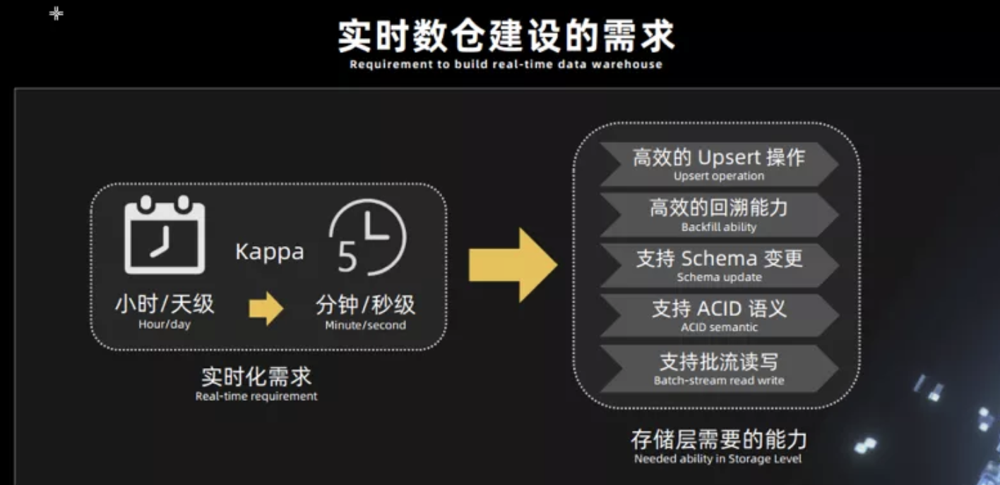
>
>## 二、数据湖 Apache Iceberg 的介绍
>
>### 1. Iceberg 是什么
>
>首先介绍一下什么是 Iceberg。官网描述如下：
>
>Apache Iceberg is an open table format for huge analytic datasets. Iceberg adds tables to Presto and Spark that use a high-performance format that works just like a SQL table.
>
>Iceberg 的官方定义是一种表格式，可以简单理解为是基于计算层（Flink , Spark）和存储层（ORC，Parqurt，Avro）的一个中间层，用 Flink 或者 Spark 将数据写入 Iceberg，然后再通过其他方式来读取这个表，比如 Spark，Flink，Presto 等。
>
>### 2. Iceberg 的 table format 介绍
>
>Iceberg 是为分析海量数据准备的，被定义为 table format，**table format 介于计算层和存储层之间**。
>
>table format 主要用于 **向下管理在存储系统上的文件，向上为计算层提供一些接口。存储系统上的文件存储都会采用一定的组织形式，譬如读一张 Hive 表的时候，HDFS 文件系统会带一些 partition，数据存储格式、数据压缩格式、数据存储 HDFS 目录的信息等，这些信息都存在 Metastore 上，Metastore 就可以称之为一种文件组织格式。**
>
>**一个优秀的文件组织格式，如 Iceberg，可以更高效的支持上层的计算层访问磁盘上的文件，做一些 list、rename 或者查找等操作。**
>
>### 3.Iceberg 的能力总结
>
>Iceberg 目前支持三种文件格式 **parquet，Avro，ORC**，如图 7，无论是 HDFS 或者 S3 上的文件，可以看到有行存也有列存，后面会详细的去介绍其作用。Iceberg 本身具备的能力总结如下（如图 8），这些能力对于后面我们利用 Iceberg 来构建实时数仓是非常重要的。
>
>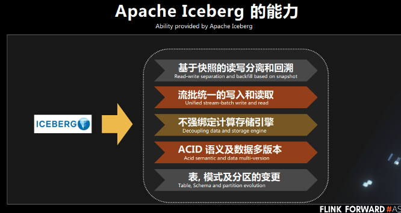
>
>### 4. Iceberg 的文件组织格式介绍
>
>下图展示的是 Iceberg 的整个文件组织格式。从上往下看：
>
>- **首先最上层是 snapshot 模块。**Iceberg 里面的 snapshot 是一个用户可读取的基本的数据单位，也就是说用户每次读取一张表里面的所有数据，**都是一个snapshot 下的数据**。
>- 其次，manifest。一个 snapshot 下面会有多个 manifest，**如图 snapshot-0 有两个 manifest，而 snapshot-1 有- 三个 manifest，每个 manifest 下面会管理一个至多个 DataFiles 文件。**
>- 第三，**DataFiles。manifest 文件里面存放的就是数据的元信息，我们可以打开 manifest 文件，可以看到里面其实是一行行的 datafiles 文件路径。**
>
>从图上看到，**snapshot-1 包含了 snapshop-0 的数据，而 snapshot-1 这个时刻写入的数据只有 manifest2，这个能力其实就为我们后面去做增量读取提供了一个很好的支持。**
>
>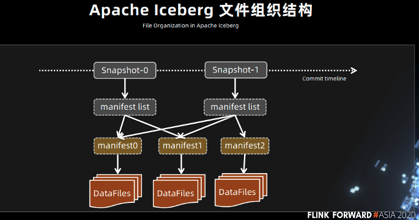
>
>### 5.Iceberg 读写过程介绍
>
>#### ■ Apache Iceberg 读写
>
>首先，**如果有一个 write 操作，在写 snapsho-1 的时候，snapshot-1 是虚线框，也就是说此时还没有发生 commit 操作。这时候对 snapshot-1 的读其实是不可读的，因为用户的读只能读到已经 commit 之后的 snapshot。**发生 commit 之后才可以读。同理，会有 snapshot-2，snapshot-3。
>
>Iceberg 提供的一个重要能力，就是**读写分离能力**。在对 **snapshot-4 进行写的时候，其实是完全不影响对 snapshot-2 和 snapshot-3 的读。Iceberg 的这个能力对于构建实时数仓是非常重要的能力之一。**
>
>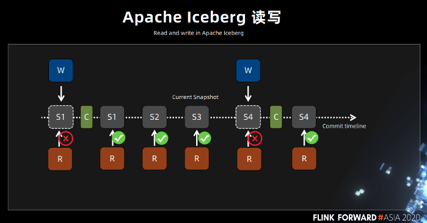
>
>同理，读也是可以并发的，可以同时读 s1、s2、s3 的快照数据，这就提供了回溯读到 snapshot-2 或者 snapshot-3 数据的能力。Snapshot-4 写完成之后，会发生一次 commit 操作，这个时候 snapshot-4 变成了实心，此时就可以读了。另外，可以看到 current Snapshot 的指针移到 s4，也就是说默认情况下，**用户对一张表的读操作，都是读 current Snapshot 指针所指向的 Snapshot，但不会影响前面的 snapshot 的读操作。**
>
>#### ■ Apache Iceberg 增量读
>
>接下来讲一下 Iceberg 的增量读。首先我们知道 Iceberg 的读操作只能基于已经提交完成的 snapshot-1，此时会有一个 snapshot-2，可以看到每个 snapshot 都包含前面 snapshot 的所有数据，**如果每次都读全量的数据，整个链路上对计算引擎来说，读取的代价非常高。**
>
>如果只希望读到当前时刻新增的数据，这个时候其实就可以根据 Iceberg 的 snapshot 的回溯机制，仅读取 snapshot1 到 snapshot2 的增量数据，**也就是紫色这块的数据可以读的。**
>
>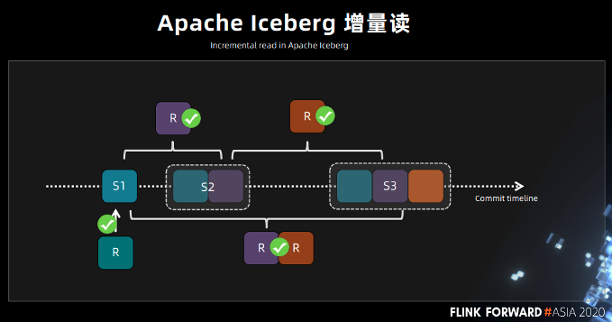
>
>同理 s3 也是可以只读黄色的这块区域的数据，同时也可以读 s3 到 s1 这块的增量数据，**基于 Flink source 的 streaming reader 功能在内部我们已经实现这种增量读取的功能，并且已经在线上运行了。刚才讲到了一个非常重要的问题，既然 Iceberg 已经有了读写分离，并发读，增量读的功能，Iceberg 要跟 Flink 实现对接，那么就必须实现 Iceberg 的 sink。**
>
>#### ■ 实时小文件问题
>
>社区现在已经重构了 Flink 里面的 FlinkIcebergSink，提供了 global committee 的功能，我们的架构其实跟社区的架构是保持一致的，曲线框中的这块内容是 FlinkIcebergSink。
>
>在有多个 **IcebergStreamWriter 和一个 IcebergFileCommitter 的情况下，上游的数据写到 IcebergStreamWriter 的时候，每个 writer 里面做的事情都是去写 datafiles 文件。**
>
>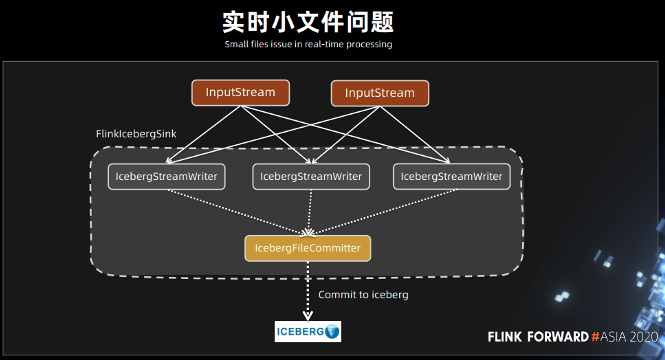
>
>**当每个 writer 写完自己当前这一批 datafiles 小文件的时候，就会发送消息给 IcebergFileCommitter，告诉它可以提交了。而 IcebergFileCommitter 收到信息的时，就一次性将 datafiles 的文件提交，进行一次 commit 操作。**
>
>**commit 操作本身只是对一些原始信息的修改，当数据都已经写到磁盘了，只是让其从不可见变成可见。在这个情况下，Iceberg 只需要用一个 commit 即可完成数据从不可见变成可见的过程。**
>
>#### ■ 实时小文件合并
>
>Flink 实时作业一般会长期在集群中运行，为了要保证数据的时效性，一般会把 Iceberg commit 操作的时间周期设成 30 秒或者是一分钟。当 Flink 作业跑一天时，如果是一分钟一次 commit，一天需要 1440 个 commit，如果 Flink 作业跑一个月commit 操作会更多。**甚至 snapshot commit 的时间间隔越短，生成的 snapshot 的数量会越多。当流式作业运行后，就会生成大量的小文件。**
>
>这个问题如果不解决的话，Iceberg 在 Flink 处理引擎上的 sink 操作就不可用了。**我们在内部实现了一个叫做 data compaction operator 的功能，这个 operator 是跟着 Flink sink 一起走的。当 Iceberg 的 FlinkIcebergSink 每完成一次 commit 操作的时候，它都会向下游 FileScanTaskGen 发送消息，告诉 FileScanTaskGen 已经完成了一次 commit。**
>
>
>
>FileScanTaskGen 里面会有相关的逻辑，**能够根据用户的配置或者当前磁盘的特性来进行文件合并任务的生成操作。FileScanTaskGen 发送到 DataFileRewitre 的内容其实就是在 FileScanTaskGen 里面生成的需要合并的文件的列表。同理，因为合并文件是需要一定的耗时操作，所以需要将其进行异步的操作分发到不同的 task rewrite operator 中。**
>
>上面讲过的 Iceberg 是有 commit 操作，对于 rewrite 之后的文件需要有一个新的 snapshot 。这里对 Iceberg 来说，也是一个 commit 操作，所以采用一个单并发的像 commit 操作一样的事件。
>
>整条链路下来，**小文件的合并目前采用的是 commit 操作，如果 commit 操作后面阻塞了，会影响前面的写入操作，这块我们后面会持续优化。**现在我们也在 Iceberg 社区开了一个 design doc 文档在推进，跟社区讨论进行合并的相关工作。
>
>## 三、Flink+Iceberg 构建实时数仓
>
>### 1.近实时的数据接入
>
>前面介绍了 Iceberg 既支持读写分离，又支持**并发读、增量读、小文件合并，还可以支持秒级到分钟级的延迟**，基于这些优势我们尝试采用 Iceberg 这些功能来构建基于 Flink 的实时全链路批流一体化的实时数仓架构。
>
>如下图所示，Iceberg 每次的 commit 操作，都是对数据的可见性的改变，比如说让数据从不可见变成可见，在这个过程中，就可以实现近实时的数据记录。
>
>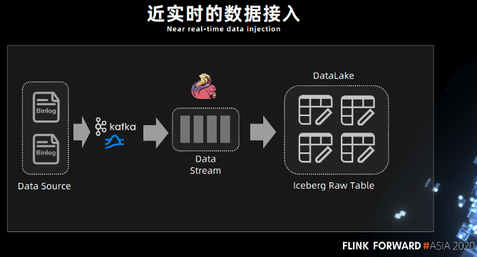
>
>### 2.实时数仓 - 数据湖分析系统
>
>此前需要先进行数据接入，比如用 Spark 的离线调度任务去跑一些数据，拉取，抽取最后再写入到 Hive 表里面，这个过程的延时比较大。**有了 Iceberg 的表结构，可以中间使用 Flink，或者 spark streaming，完成近实时的数据接入。**
>
>基于以上功能，我们再来回顾一下前面讨论的 Kappa 架构，Kappa 架构的痛点上面已经描述过，**Iceberg 既然能够作为一个优秀的表格式，既支持 Streaming reader，又可以支持 Streaming sink，是否可以考虑将 Kafka 替换成 Iceberg？**
>
>**Iceberg 底层依赖的存储是像 HDFS 或 S3 这样的廉价存储，而且 Iceberg 是支持 parquet、orc、Avro 这样的列式存储。有列式存储的支持，就可以对 OLAP 分析进行基本的优化，在中间层直接进行计算。**例如谓词下推最基本的 OLAP 优化策略，基于 Iceberg snapshot 的 Streaming reader 功能，可以把离线任务天级别到小时级别的延迟大大的降低，改造成一个近实时的数据湖分析系统。
>
>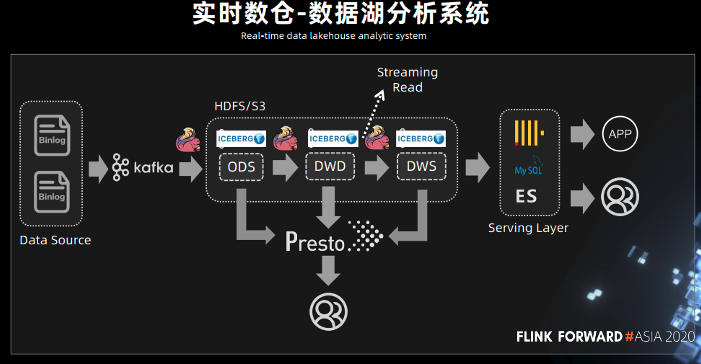
>
>在中间处理层，可以用 presto 进行一些简单的查询，因为 Iceberg 支持 Streaming read，所以在**系统的中间层也可以直接接入 Flink**，**直接在中间层用 Flink 做一些批处理或者流式计算的任务，把中间结果做进一步计算后输出到下游。**
>
>#### ■ 替换 Kafka 的优劣势
>
>总的来说，Iceberg 替换 Kafka 的优势主要包括：
>
>- **实现存储层的流批统一**
>- **中间层支持 OLAP 分析**
>- **完美支持高效回溯**
>- **存储成本降低**
>
>当然，也存在一定的缺陷，如：
>
>- **数据延迟从实时变成近实时**
>- **对接其他数据系统需要额外开发工作**
>
>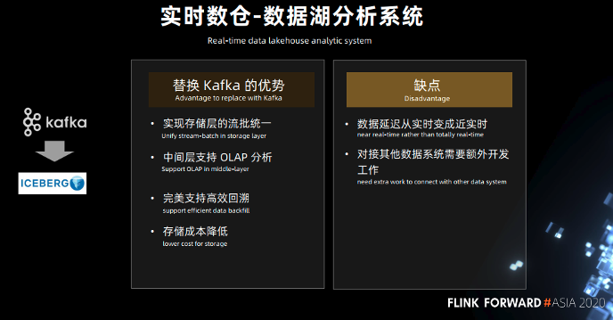
>
>#### ■ 秒级分析 - 数据湖加速
>
>由于 Iceberg 本身是将数据文件全部存储在 HDFS 上的，HDFS 读写这块对于秒级分析的场景，还是不能够完全满足我们的需求，所以接下去我们会在 Iceberg 底层支持 Alluxio 这样一个缓存，借助于缓存的能力可以实现数据湖的加速。这块的架构也在我们未来的一个规划和建设中。
>
>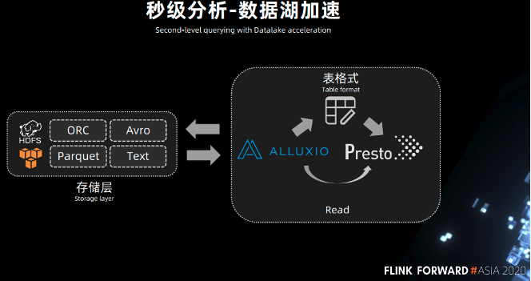
>
>### 3.最佳实践
>
>#### ■ 实时小文件合并
>
>如图 18 所示，**腾讯内部已经实现了 Iceberg 的完全 SQL 化，其实我们在 table properties 里面可以设置一些小文件合并的参数，例如 snapshot 达到多少进行一次合并，一共有多少个 snapshot 时进行合并等，这样底层就可以直接通过一条 insert 语句启动 Flink 入湖任务，整个任务就可以持续运行，后台数据的 datafiles 文件也会在后台自动完成合并的操作。**
>
>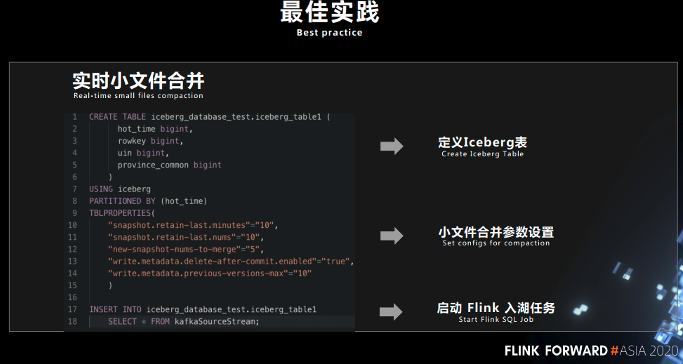
>
>下面这张图就是 Iceberg 中数据文件和数据文件对应的 meta 文件的信息，因为现在社区开源的 IceberFlinkSink 还没有文件合并的功能，可以尝试打开一个比较小的流处理任务，然后在自己电脑上跑一下，可以看到 Flink 任务运行之后，一段时间后，对应目录的文件数就会暴涨。
>
>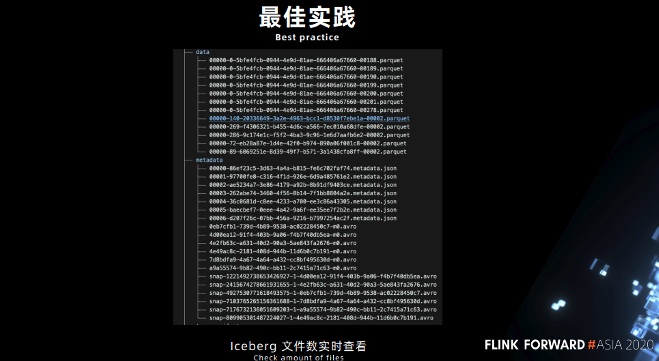
>
>利用了 Iceberg 的实时合并小文件功能之后，**可以看到文件数其实是可以控制在一个比较稳定的数量。**
>
>#### ■ Flink 实时增量读取
>
>实现实时数据的增量读取，可以将其配置到 Iceberg 的 table properties 参数里面，并且可以指定从哪个 snapshot 开始消费。如果指定了从哪个 snapshot 消费之后，每次 Flink 任务启动，就只会读取当前最新 snapshot 里面新增的数据。
>
>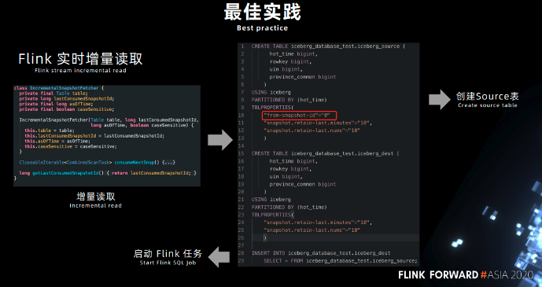
>
>在本实例中，开启了小文件合并的功能，最后用 SQL 启动了一个 Flink sink 的入湖任务。
>
>#### ■ SQL Extension 管理文件
>
>当前用户非常希望所有的任务都用 SQL 来解决，**小文件合并的功能其实只适用于在线上跑的一些 Flink 任务，相较于离线任务来说，每一次 commit 周期内它所生成的文件数量或者文件大小都不会特别大**。
>
>但当用户的任务跑了比较长的时间，底层的文件可能已经成千上万个了，这个时候直接在线上用实时的任务去做合并显然是不合适的，并可能会影响到线上实时任务的时效性，我们可以通过使用 SQL extension 来处理小文件合并，或者是删除遗留的文件，或者是过期 snapshot。
>
>我们内部其实已经实现了通过用 SQL extension 的方式来管理 Iceberg 在磁盘上的数据和数据元信息的文件，后面我们会持续的往 SQL extension 增加更多的功能，来完善 Iceberg 的可用性，提升用户体验。
>
>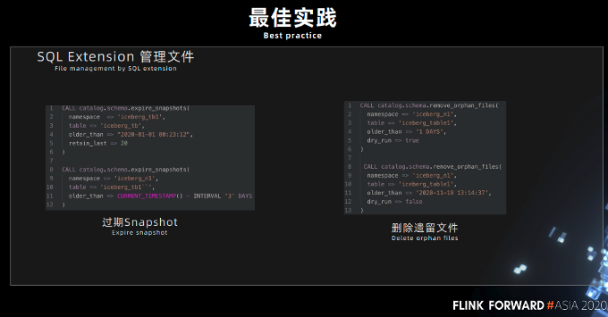
>
>## 四、未来规划
>
>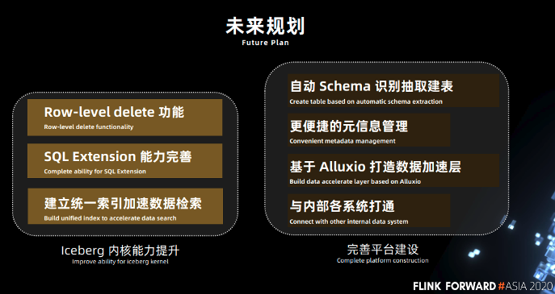
>
>### 1.Iceberg 内核能力提升
>
>- **Row-level delete 功能**。在用 Iceberg 构建整个数据链路的过程中，如果有数据的更新怎么办？Iceberg 当前只支持 copy on write 的 update 的能力，copy on write 对写是有一个放大的作用，如果要真正的在整个链路上构建一个实时数据处理过程，还是需要一个高效的 merge on read 的 update 能力。这是非常重要的，后面我们也会再继续跟社区合作，腾讯内部也会去做一些实践，去完善 Row-level delete 的功能。
>- **SQL Extension 能力完善**。我们会更加完善 SQL Extension 的能力。
>- **建立统一索引加速数据检索**。Iceberg 现在并没有统一的索引来加速数据检索，现在我们也在跟社区合作，社区也提出了一个 Bloom Filter 的索引能力，通过构建统一的索引，可以加速 iceberg 检索文件的能力。
>
>在 Iceberg 的内核提升方面，我们主要是希望先能够把这些功能给完善。
>
>### 2.平台建设
>
>在平台建设方面，我们将尝试：
>
>- 首先，**自动 Schema 识别抽取建表**。希望能够自动的根据前端的数据 Schema 信息，能够自动的将这个表给创建出来，更方便用户去使用整个数据入湖的一个流程。
>- 其次，**更便捷的数据元信息管理**。Iceberg 现在的元信息其实都是裸的，都是直接放在 hive metastore 上的，如果用户需要查看数据元信息，其实还需要去跑 SQL，我们希望在平台化的建设中把它给继续的完善。
>- 第三，**基于 Alluxio 打造数据加速层**。希望用 Alluxio 打造一个数据湖加速层功能，以方便上层更加好的去实现一个秒级分析的能力。
>- 第四，**与内部各系统打通**。其实我们内部还有很多像实时离线分析的各个系统，我们也是需要将我们整个平台跟内部的各个系统之间进行一个打通串联的工作。

## Iceberg删除墓碑文件/孤立文件

>## **1.1. 删除墓碑文件**
>
>**墓碑文件是指非当前快照直接引用的数据文件和元数据文件。墓碑文件将占用HDFS的存储空间。删除墓碑文件后，涉及的历史快照将无法做为iceberg的数据版本回滚和数据时光旅行的目标使用。**
>
>删除墓碑文件的 DDL SQL 为：
>
>-- 删除早于2021-06-30日快照的墓碑数据文件，但保留最近5个快照的墓碑数据文件
>
>CALL iceberg_catalog.system.expire_snapshots('db.tb', TIMESTAMP '2021-06-30 00:00:00.000', 5)
>
>SQL的返回值为：
>
>+------------------------+----------------------------+----------------------------+
>|deleted_data_files_count|deleted_manifest_files_count|deleted_manifest_lists_count|
>+------------------------+----------------------------+----------------------------+
>| 0                    | 0                       | 0                        |
>+------------------------+----------------------------+----------------------------+
>
>-- 使用默认值（删除5天前的所有快照）
>
>CALL iceberg_catalog.system.expire_snapshots('db.tb')
>
>## **1.2.删除孤立文件**
>
>**孤立文件是指表中任何快照都引用不到的数据文件和元数据文件。如Spark任务在写入iceberg过程中，未完成一个完整事务就被强制停止，则会在表中残留一些孤立数据文件。**
>
>请注意，一般删除孤立文件时，只删除文件创建时间大于3天的孤立文件。如果删除过近创建的孤立文件，将有可能错误的将正在运行的任务产生的未提交文件删除。
>
>删除孤立文件的 DDL SQL 为：
>
>-- 删除创建时间早于2021-06-29日的孤立文件
>
>CALL iceberg_catalog.system.remove_orphan_files('merge_target2', TIMESTAMP '2021-06-29 00:00:00.000')
>
>SQL的返回值为：
>
>+----------------------------------------------------------------------------------------------------------------------------+
>|orphan_file_location                                                                                             |
>+----------------------------------------------------------------------------------------------------------------------------+
>|hdfs://xxx                                                                                                     |
>
>|hdfs://xxx                                                                                                  |
>+----------------------------------------------------------------------------------------------------------------------------+
>
>-- 使用默认值（删除创建时间大于3天的孤立文件）
>
>CALL iceberg_catalog.system.remove_orphan_files('db.tb')

## 详述 Flink CDC 打通数据实时入湖   案例详细

https://developer.aliyun.com/article/990843

>**b）测试数据情况**
>
>数据入湖分为append和upsert两种方式。append方式只能新增数据，不能对结果数据进行更新操作；upsert方式能够对结果数据更新。
>
>append方式使用场景是导入数据之前已经明确该表数据不需要更新，如离线数据导入数据湖的场景，append方式下导入数据速度如下：
>
>```java
>INSERT INTO IcebergTable SELECT * FROM KafkaTable;
>
>并行度1 12.2万/秒
>并行度2 19.6万/秒
>并行度4 28.3万/秒
>12345
>```
>
>update方式使用场景是既有插入的数据又有对之前插入数据的更新的场景，如数据库实时同步，upsert方式下导入数据速度，该方式需要指定在更新时以那个字段查找，类似于update语句中的where条件，一般设置为表的主键即可，如下：
>
>```java
>INSERT INTO IcebergTable /*+OPTIONS('equality-field-columns'='id')*/ SELECT * FROM KafkaTable;
>
>导入的数据 只有数据插入 只有数据更新
>并行度1 3.2万/秒 2.9万/秒
>并行度2 4.9万/秒 4.2万/秒
>并行度4 6.1万/秒 5.1万/秒
>123456
>```
>
>**c）结论**
>
>- append方式导入速度远大于upsert导入数据速度。在使用的时候，如没有更新数据的场景时，则不需要upsert方式导入数据。
>- 导入速度随着并行度的增加而增加。
>- upsert方式数据的插入和更新速度相差不大，主要得益于MOR原因。
>
>

## 数据湖（十）：Hive与Iceberg整合  从官网上翻译来的

https://zhuanlan.zhihu.com/p/540069705

>## **一、开启 Hive 支持 Iceberg**
>
>### **1、下载iceberg-hive-runtime.jar**
>
>想要使用 Hive 支持查询Iceberg表，首先需要下载“iceberg-hive-runtime.jar”，**Hive通过该Jar可以加载Hive或者更新Iceberg表元数据信息。**
>
>将以上jar包下载后，上传到Hive服务端和客户端对应的lib目录下。**另外在向Hive中Iceberg格式表插入数据时需要到“libfb303-0.9.3.jar”包，将此包也上传到Hive服务端和客户端对应的lib目录下。**
>
>### **2、配置hive-site.xml**
>
>在Hive客户端$HIVE_HOME/conf/hive-site.xml中添加如下配置：
>
>```xml
><property>
>    <name>iceberg.engine.hive.enabled</name>
>    <value>true</value>
></property>
>```
>
>## **二、Hive中操作Iceberg格式表**
>
>**从Hive引擎的角度来看，在运行环境中有Catalog概念（catalog主要描述了数据集的位置信息，就是元数据），Hive与Iceberg整合时，Iceberg支持多种不同的Catalog类型，**例如:Hive、Hadoop、第三方厂商的AWS Glue和自定义Catalog。在实际应用场景中，Hive可能使用上述任意Catalog，甚至跨不同Catalog类型join数据，**为此Hive提供了org.apache.iceberg.mr.hive.HiveIcebergStorageHandler（位于包iceberg-hive-runtime.jar）来支持读写Iceberg表**，并通过在Hive中设置“iceberg.catalog.<catalog_name>.type”属性来决定加载Iceberg表的方式，该属性可以配置：hive、hadoop，其中“<catalog_name>”是自己随便定义的名称，主要是在hive中创建Iceberg格式表时配置iceberg.catalog属性使用。
>
>**在Hive中创建Iceberg格式表时，根据创建Iceberg格式表时是否指定iceberg.catalog属性值，有以下三种方式决定Iceberg格式表如何加载（数据存储在什么位置）。**
>
>### **1、如果没有设置iceberg.catalog属性，默认使用HiveCatalog来加载**
>
>这种方式就是说如果在Hive中创建Iceberg格式表时，不指定iceberg.catalog属性，那么数据存储在对应的**hive warehouse路径下。**
>
>在Hive客户端node3节点进入Hive，操作如下：
>
>```sh
>#在Hive中创建iceberg格式表
>create table test_iceberg_tbl1(
>id int ,
>name string,
>age int) 
>partitioned by (dt string) 
>stored by 'org.apache.iceberg.mr.hive.HiveIcebergStorageHandler';
>
>#在Hive中加载如下两个包，在向Hive中插入数据时执行MR程序时需要使用到
>hive> add jar /software/hive-3.1.2/lib/iceberg-hive-runtime-0.12.1.jar;
>hive> add jar /software/hive-3.1.2/lib/libfb303-0.9.3.jar;
>
>#向表中插入数据
>hive> insert into test_iceberg_tbl1 values (1,"zs",18,"20211212");
>
>#查询表中的数据
>hive> select * from test_iceberg_tbl1;
>OK
>1 zs 18 20211212
>```
>
>
>
>### **2、如果设置了iceberg.catalog对应的catalog名字，就用对应类型的catalog加载**
>
>这种情况就是说在 Hive 中创建 Iceberg 格式表时，**如果指定了iceberg.catalog属性值，那么数据存储在指定的catalog名称对应配置的目录下。**
>
>在Hive客户端node3节点进入Hive，操作如下：
>
>```shell
>#注册一个HiveCatalog叫another_hive
>hive> set iceberg.catalog.another_hive.type=hive;
>
>#在Hive中创建iceberg格式表
>create table test_iceberg_tbl2(
>id int,
>name string,
>age int
>)
>partitioned by (dt string)
>stored by 'org.apache.iceberg.mr.hive.HiveIcebergStorageHandler'
>tblproperties ('iceberg.catalog'='another_hive');
>
>#在Hive中加载如下两个包，在向Hive中插入数据时执行MR程序时需要使用到
>hive> add jar /software/hive-3.1.2/lib/iceberg-hive-runtime-0.12.1.jar;
>hive> add jar /software/hive-3.1.2/lib/libfb303-0.9.3.jar;
>
>#插入数据(数据存入指定 catalog 下)，并查询
>hive> insert into test_iceberg_tbl2 values (2,"ls",20,"20211212");
>hive> select * from test_iceberg_tbl2;
>OK
>2 ls 20 20211212
>```
>
>以上方式指定“iceberg.catalog.**another_hive**.type=hive”后，**实际上就是使用的hive的catalog，这种方式与第一种方式不设置效果一样，创建后的表存储在hive默认的warehouse目录下。也可以在建表时指定location 写上路径，将数据存储在自定义对应路径上。**
>
>**除了可以将 catalog 类型指定成hive之外，还可以指定成hadoop，在Hive中创建对应的iceberg格式表时需要指定location来指定iceberg数据存储的具体位置，**这个位置是**具有一定格式规范**的自定义路径。在Hive客户端node3节点进入Hive，操作如下：
>
>```shell
>#注册一个HadoopCatalog叫hadoop
>hive> set iceberg.catalog.hadoop.type=hadoop;
>
>#使用HadoopCatalog时，必须设置“iceberg.catalog.<catalog_name>.warehouse”指定warehouse路径
>hive> set iceberg.catalog.hadoop.warehouse=hdfs://mycluster/iceberg_data;
>
>#在Hive中创建iceberg格式表,这里创建成外表
>create external table test_iceberg_tbl3(
>id int,
>name string,
>age int
>)
>partitioned by (dt string)
>stored by 'org.apache.iceberg.mr.hive.HiveIcebergStorageHandler'
>location 'hdfs://mycluster/iceberg_data/default/test_iceberg_tbl3'
>tblproperties ('iceberg.catalog'='hadoop');
>
>注意：以上location指定的路径必须是“iceberg.catalog.hadoop.warehouse”指定路径的子路径,格式必须是${iceberg.catalog.hadoop.warehouse}/${当前建表使用的hive库}/${创建的当前iceberg表名}
>
>#在Hive中加载如下两个包，在向Hive中插入数据时执行MR程序时需要使用到
>hive> add jar /software/hive-3.1.2/lib/iceberg-hive-runtime-0.12.1.jar;
>hive> add jar /software/hive-3.1.2/lib/libfb303-0.9.3.jar;
>
>#插入数据，并查询
>hive> insert into test_iceberg_tbl3 values (3,"ww",20,"20211213");
>hive> select * from test_iceberg_tbl3;
>OK
>3 ww 20 20211213
>```
>
>### **3、如果iceberg.catalog属性设置为“location_based_table”,可以从指定的根路径下加载Iceberg表**
>
>这种情况就是说**如果HDFS中已经存在iceberg格式表，我们可以通过在Hive中创建Icerberg格式表指定对应的location路径映射数据。**在Hive客户端中操作如下：
>
>```sql
>CREATE TABLE test_iceberg_tbl4  (
>  id int, 
>  name string,
>  age int,
>  dt string
>)STORED BY 'org.apache.iceberg.mr.hive.HiveIcebergStorageHandler' 
>LOCATION 'hdfs://mycluster/spark/person' 
>TBLPROPERTIES ('iceberg.catalog'='location_based_table');
>
>注意：指定的location路径下必须是iceberg格式表数据，并且需要有元数据目录才可以。不能将其他数据映射到Hive iceberg格式表。
>```
>
>注意：**由于Hive建表语句分区语法“Partitioned by”的限制, 如果使用Hive创建Iceberg格式表，目前只能按照Hive语法来写，底层转换成Iceberg标识分区，这种情况下不能使用Iceberge的分区转换，例如：days(timestamp)，如果想要使用Iceberg格式表的分区转换标识分区，需要使用Spark或者Flink引擎创建表。**


